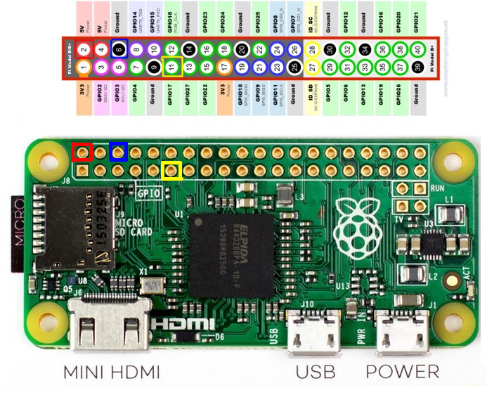

# Final Project - Physical Computing and the Internet of Things

*Name:* Patricia Torvalds PMT

*Date:* December 2017

## Project:  < Name of your Project / Device Goes here >

My project satirizes the use of the word "China" in order to derail conversations about American policy or internet freedom by taking live tweets which use the word "China" and using natural language processing to rank their favorability on a 180 degree scale, ranking the tweets as "good" or "bad."

### Detailed Project Description

In my time as a computer science major at Duke, discussions of a free internet or other intellectual property rights are derailed by invocations of "China" or Chinese politics. I chose to critically examine and satirize this trend, which plays on Orientalist ideas of a regressive Chinese state and prevents meaningful discussion.
The Raspberry Pi Zero runs a Python script which gathers all public Tweets (not retweets) containing the word "China" and then runs sentiment analysis on them using the TextBlob library to determine the overall sentiment of a tweet from -1.00 to 1.00. All tweets and scores, as well as their timestamps, are saved to a local database using sqlite3 in order to find averages and view data over time.

< Explain the "what" of your project:   What is it?   What does it do?   Explain the "why" of your project:  What problem is it responding to?  What issue is it engaging?   

### Technical Description

The project is made of a Raspberry Pi in a small case and a micro servo with a single-sided pointer in order to convert the data into its physical form. In order to maintain the core idea of the project, which was to simplify the complexity of China as a nation by distilling all meaning into a number based on a Tweet, I decided to also keep the hardware components simple. I soldered headers onto the Raspberry Pi in order to connect the servo, and then used a pointer specifically angled to translate the tweet score into 180 degree motion.

I was originally going to use the graphical interface of NodeRed for the software component of the project. However, with Prof. Kenney's help I set up a Python script and a sqlite3 database in order to store past tweets while collecting, scoring, and sending them to the RasPi in real time. By SSHing in to the Raspberry Pi I was able to upload my script and run it.


< Explain the "how" of your project.  What are the hardware components?  What are the software components?  How do they interact with each other? >

< You can also explain the development process here >


#### Hardware Wiring Diagram


The images above show only the wiring of my project. The modified image of a Raspberry Pi and its pins is colorcoded to show which pin refers to ground, power, and to the control of the servo, while the photograph shows directly what the wiring looks like.

#### Code

After importing tweepy, to pull tweets; sqlite3, to store them; and TextBlob, to analyze them, my Python script attaches the servo to Pin 11 as shown in the wiring diagram above. It also uses OAuth in order to allow access to Twitter from Tweepy. To do this I created a simple Twitter app via Twitter's Application Manager in order to obtain private consumer keys and access tokens as shown:

```python
db = sqlite3.connect('database.db')
cursor = db.cursor()
auth = tweepy.OAuthHandler(consumer_key, consumer_secret)
auth.set_access_token(access_token, access_token_secret)
api = tweepy.API(auth)
```

Then, the script calls Tweepy to search all tweets containing the word "China" which are not retweets or quoted Tweets (RT @) and prints the content of the Tweet as well at its author, and initializes a variable for the tweet's timestamp:
```python
for tweet in tweepy.Cursor(api.search, q="china").items():
    if (not tweet.retweeted) and ('RT @' not in tweet.text):
        try:
            print(tweet.user.screen_name)
            print((tweet.text).encode('utf-8').strip())
            user = tweet.user.screen_name
            tweet_text = tweet.text
            tweet_time = tweet.created_at
```

Then, the script takes all the text in the tweet and analyzes it by the Tweet's polarity. TextBlob also allows for Tweets to be analyzed for their objectivity, but since this was not a primary focus of my project (in fact, objectivity was not a part of this project at all), I chose not to include this metric. Then, I printed the Tweet sentiment to the console and committed it to the database along with a timestamp:
```python
            blob = TextBlob(tweet.text)
            for sentence in blob.sentences:
                print(sentence.sentiment.polarity)
                cursor.execute('''INSERT INTO tweet(created_at, tweet_sentiment)
                        VALUES(?,?)''', (tweet_time, sentence.sentiment.polarity))
            db.commit()
            sleep(3)
```

The last step was to transform the tweet's sentiment analysis, which falls between -1.00 and 1.00, into a range from 0 to 180 so that it would have meaning to the servo itself. I did this through a simple range_of_motion equation:
```python
            range_of_motion = (((sentence.sentiment.polarity + 1) * 180) / 2)
            DC=1./18.*(range_of_motion)+2
            pwm.ChangeDutyCycle(DC)
```

Some error catching and then I was good to finish up the script as below.
```python
pwm.stop()
GPIO.cleanup()
```

All my code can be found at [servo.py](code/servo.py), but I had one other step before everything was done, and that was to set up the sqlite3 database.

With Prof. Kenney's help, I was able to write a short sqlite file which created the database table as below.
```
CREATE TABLE tweet(
	tweet integer PRIMARY KEY,
	created_at text,
	tweet_sentiment
)
```

### Design / Form

To create a visual representation of an overly simplified idea, I thought it would be fitting to create a simple "spinner" which the pointer would move on to display "bad," "neutral," or "good." I wanted to retain the simplicity of the concept while still making the design feel accessible and even funny. 

< Explain the device's form, the aesthetic choices made and how they relate to the concept/function the device is intended to engage >

< include photos of your device >

### Evaluation / Reflection

< What is your own evaluation of your project?   What did you learn through this project?  What would you do differently in the future? >
