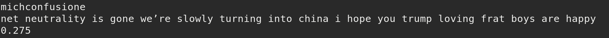

# Final Project - Physical Computing and the Internet of Things

*Name:* Patricia Torvalds PMT

*Date:* December 2017

## Project: "CHINA?"

My project satirizes the use of the word "China" in order to derail conversations about American policy or internet freedom by taking live tweets which use the word "China" and using natural language processing to rank their favorability on a 180 degree scale, ranking the tweets as "good" or "bad."

### Detailed Project Description

In my time as a computer science major at Duke, discussions of a free internet or other intellectual property rights are derailed by invocations of "China" or Chinese politics. I chose to critically examine and satirize this trend, which plays on Orientalist ideas of a regressive Chinese state and prevents meaningful discussion.
The Raspberry Pi Zero runs a Python script which gathers all public Tweets (not retweets) containing the word "China" and then runs sentiment analysis on them using the TextBlob library to determine the overall sentiment of a tweet from -1.00 to 1.00. All tweets and scores, as well as their timestamps, are saved to a local database using sqlite3 in order to find averages and view data over time. The sentiment is transformed into a score between 0 and 180 which is displayed on a 180 degree gauge attached to a servo on a Raspberry Pi.


### Technical Description

The project is made of a Raspberry Pi in a small case and a micro servo with a single-sided pointer in order to convert the data into its physical form on  a 180 degree gauge. In order to maintain the core idea of the project, which was to simplify the complexity of China as a nation by distilling all meaning into a number based on a Tweet, I decided to also keep the hardware components simple. I soldered headers onto the Raspberry Pi in order to connect the servo, and then used a pointer specifically angled to translate the tweet score into 180 degree motion.

I was originally going to use the graphical interface of NodeRed for the software component of the project. However, with Prof. Kenney's help I set up a Python script and a sqlite3 database in order to store past tweets while collecting, scoring, and sending them to the RasPi in real time. By SSHing in to the Raspberry Pi I was able to upload my script and run it, and by accessing a sqlite database I was able to collect, observe, and even average all of the data.


#### Hardware Wiring Diagram


The images above show only the wiring of my project. The modified image of a Raspberry Pi and its pins is colorcoded to show which pin refers to ground, power, and to the control of the servo, while the photograph shows directly what the wiring looks like.

#### Code

After importing tweepy, to pull tweets; sqlite3, to store them; and TextBlob, to analyze them, my Python script attaches the servo to Pin 11 as shown in the wiring diagram above. It also uses OAuth in order to allow access to Twitter from Tweepy. To do this I created a simple Twitter app via Twitter's Application Manager in order to obtain private consumer keys and access tokens as shown:

```python
db = sqlite3.connect('database.db')
cursor = db.cursor()
auth = tweepy.OAuthHandler(consumer_key, consumer_secret)
auth.set_access_token(access_token, access_token_secret)
api = tweepy.API(auth)
```

Then, the script calls Tweepy to search all tweets containing the word "China" which are not retweets or quoted Tweets (RT @) and prints the content of the Tweet as well at its author, and initializes a variable for the tweet's timestamp:
```python
for tweet in tweepy.Cursor(api.search, q="china").items():
    if (not tweet.retweeted) and ('RT @' not in tweet.text):
        try:
            print(tweet.user.screen_name)
            print((tweet.text).encode('utf-8').strip())
            user = tweet.user.screen_name
            tweet_text = tweet.text
            tweet_time = tweet.created_at
```

Then, the script takes all the text in the tweet and analyzes it by the Tweet's polarity. TextBlob also allows for Tweets to be analyzed for their objectivity, but since this was not a primary focus of my project (in fact, objectivity was not a part of this project at all), I chose not to include this metric. Then, I printed the Tweet sentiment to the console and committed it to the database along with a timestamp:
```python
            blob = TextBlob(tweet.text)
            for sentence in blob.sentences:
                print(sentence.sentiment.polarity)
                cursor.execute('''INSERT INTO tweet(created_at, tweet_sentiment)
                        VALUES(?,?)''', (tweet_time, sentence.sentiment.polarity))
            db.commit()
            sleep(3)
```

The last step was to transform the tweet's sentiment analysis, which falls between -1.00 and 1.00, into a range from 0 to 180 so that it would have meaning to the servo itself. I did this through a simple range_of_motion equation:
```python
            range_of_motion = (((sentence.sentiment.polarity + 1) * 180) / 2)
            DC=1./18.*(range_of_motion)+2
            pwm.ChangeDutyCycle(DC)
```

Some error catching and then I was good to finish up the script as below.
```python
pwm.stop()
GPIO.cleanup()
```

All my code can be found at [servo.py](code/servo.py), but I had one other step before everything was done, and that was to set up the sqlite3 database.

With Prof. Kenney's help, I was able to write a short sqlite file which created the database table as below:
```
CREATE TABLE tweet(
	tweet integer PRIMARY KEY,
	created_at text,
	tweet_sentiment
)
```
### Sample responses / Outputs

Many tweets I found particularly interesting are displayed along with their score in the images folder, but I am also displaying them here with a brief analysis.


I found the above Tweet to be fairly standard for highly negative tweets. Many of them invoke @POTUS or Trump, and they are often linked to a Fox News tweet. They display a form of "yellow peril" associated with the fear of China becoming a world power and thereby defeating America.


The above two Tweets are positive and also relatively depoliticized. This was another trend I noticed. Unlike negative tweets, positive Tweets often referred to travel, YouTube videos (often sporting events), or financial development (which is arguably political but often neutralized).


I believe this was one of the most positive Tweets I saw (that had any meaning and wasn't simply a two-word reply). The meaning of the Tweet is somewhat obscured and could also be read negatively (manipulation) so I just found this to be an interesting fluke in sentiment analytics.


This tweet surprised me because it seemed to be actually a meaningful reply. While I certainly don't think Twitter is devoid of meaning -- it can be an amazing place to build community or spread important info -- a lot of "China" tweets seemed pretty meaningless, while this one called for attention to nuance and historical relevance. I actually looked up the entire thread by this user and found the following tweets:
<p> 
	
</p>
I really appreciated the nuance and value of this short thread.



The following two Tweets hold up China as an example of all that is "bad" (in the repeal of Net Neutrality, in their dispersal of justice) in two scenarios that don't seem to merit a call for China. Of course the second tweet was wrongly coded but it's naturally hard for the sentiment analysis to pick up sarcasm over text.


Finally, the perfect negative Tweet invokes a classic of Techno-Orientalism, holding up an example of Chinese internal affairs in headline form without providing nuance and only presenting a "scary" country in which the use of technology is subjugation. This tweet encompasses everything I was looking to critique and everything I have seen in my CS ethics class this semester.


Above is what all the tweets look like while they are coming in at regular intervals.

Finally, using sqlite3, I quantified and averaged all the Tweets to find:

I collected around 4,200 tweets for an average score of 0.04. This makes sense because most Tweets get a score of 0.0 and many times the sentiment scorer mistakes sarcasm for sincerity.

### Design / Form

To create a visual representation of an overly simplified idea, I thought it would be fitting to create a simple "spinner" which the pointer would move on to display "bad," "neutral," or "good." I wanted to retain the simplicity of the concept while still making the design feel accessible and even funny. 

I used the format of a gauge to accurately reflect the servo's 180 degree rotational ability. By using my hardware as a jumping-off point, I was able to make an object with a form and function that were well matched.


I also made a few gifs of the final product being as my computer died prior to the presentations:


### Evaluation / Reflection

This project allowed me to engage critically and, importantly, humorously in a problem that has frustrated me throughout this semester. I feel so lucky to be attending Duke and learning computer science, but I feel like discussions I have about things beyond code lack a certain nuance whenever I am discussing them with other CS majors. This semester, I declared a minor in East Asia studies after taking several AMES classes and engaging more critically in the study of China's history and role as a world power. However, I still find a good deal of Orientalism subtly present in my non-AMES classes, as students present China as a strawman for a regressive, authoritarian state when they blatantly have little to no knowledge of the country's affairs -- much like I did a year ago, and I don't plan to speak to the nature of Chinese politics or culture anytime soon.

In this project, I also learned how to actually engage in IOT devices. I think it's fairly common for me and other women in tech to feel some degree of imposter syndrome in our work, and I often felt a little bit nervous or like I wasn't truly equipped to complete a project on my own, even despite completing two full-stack development internships and being accepted for a third this summer, being a third-year computer science major at Duke, and doing "tech stuff" since before high school. There were so many times I felt like I needed to start this project, but felt completely unable to do so and paralyzed with worry about my own skill set. Adding that to a set of final projects due the Wednesday and Thursday before the presentations, I felt very incapable of actualizing the meaningful project I planned much earlier. Still, because of help from both of my professors, I was able to not only get started on this project but even to finish it (mostly!) on time and feel proud of my work. It's very gratifying to watch the Tweets come in and be translated into a value on the gauge, and to be able to explain my work and have people react to it and watch it process data. 

I learned how to use sqlite3 and how to write a Python script for Raspberry Pi, as well as how to use APIs in my RasPi app and interface with Twitter's Application management system. in the future, I would probably try to make the project more artistically appealing - even though I prefer the simplicity of the project, I also prefer artistic maximalism from a personal standpoint. I would also maybe run the program on multiple servos with a few different buzzwords (maybe "Xi Jinping") and also to visually show historical data rather than just storing it.

I would probably give this project a B grade. Even though I put in a lot of effort, I did also get a lot of help in a lot of aspects of this project, and I feel badly for not having it completed (with the visual gauge attached) on time.
